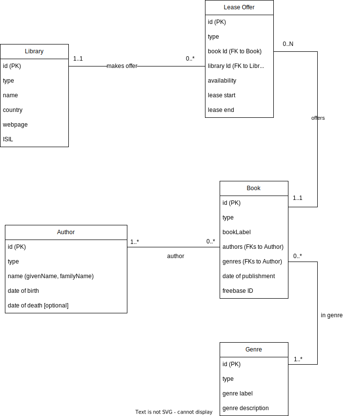

# CouchDB Tutorial

## Setup
0. have Docker and Python3 installed on your system, be sure you can use pip, python, docker-compose commands

1. clone this repo

2. `docker-compose up -d`

3. `./init-cluster.sh` or `./init-cluster.ps1` for Windows (you need to have curl.exe available OR use shell script with WSL)

4. `pip install -r requirements.txt`

5. `python init.py`

### Re-run steps

Use `docker-compose down --volumes` to delete all existing changes you made to instances. Without running `--volumes` flag the re-run of `docker-compose up -d` will reuse the volumes with data from previous run.

## ER Schema and Selected Data Model



The most effective method for CouchDB would be to use a combination of denormalization and document linking. CouchDB is a document-oriented database that is designed to store, retrieve, and manage document-oriented information in a semi-structured way. It is best suited for handling data with complex relationships and hierarchical structures. Let's discuss strategies for storing data in CouchDB.

### Denormalization

CouchDB's primary strength lies in its ability to work with denormalized data. In this case, you can consider embedding related data directly into the documents, allowing for faster and more efficient data retrieval. However, denormalization could lead to data redundancy, and updating related data across multiple documents might be more challenging.

For example, instead of maintaining separate documents for genres and authors, you can embed them into the book documents:

```
{
    "_id": "book_1",
    "type": "book",
    "bookLabel": "The Open Society and Its Enemies",
    "dop": "1945-01-01T00:00:00Z",
    "freebase": "/m/03bvw2",
    "authors": [
      {
        "_id": "author_1",
        "name": {
          "givenName": "Karl",
          "familyName": "Popper"
        },
        "dob": "1902-07-28T00:00:00Z",
        "dod": "1994-09-17T00:00:00Z"
      }
    ],
    "genres": [
      {
        "_id": "genre_1",
        "genreLabel": "philosophy",
        "genreDescription": "study of the truths and principles of being, knowledge, or conduct"
      },
      {
        "_id": "genre_2",
        "genreLabel": "other_genre",
        "genreDescription": "description of other genre"
      }
    ]
}
```

### Document Linking

In some cases, you might want to avoid excessive data duplication or when data is expected to change frequently. In such situations, you can use document linking, which involves storing the IDs of related documents within a document, thus maintaining relationships without embedding the entire related document. This approach reduces redundancy but may require additional queries to fetch related data.

For example, in the case of lease offers and libraries, you can store the IDs of related book and library documents:

```
{
    "_id": "lease_offer_1",
    "type": "lease_offer",
    "bookId": "book_472",
    "libraryId": "library_22",
    "availability": "Discontinued",
    "leaseStart": "2022-11-11T14:24:35.018196",
    "leaseEnd": "2023-07-21T14:24:35.018196"
}
```

#### Final Decision

In summary, a combination of denormalization and document linking can be an effective strategy for storing data in CouchDB for our ER schema. Ultimately, we shall utilize document linking in the majority of instances, as our intention is to employ this method during querying to exemplify the execution of SQL-like JOIN operations and more advanced features.


Denormalization allows for faster data retrieval and works well with CouchDB's document-oriented nature, while document linking helps maintain relationships and reduces redundancy in cases where data is expected to change frequently. In our particular scenario, employing denormalization for authors and genres in books documents would be optimal, given that the information pertaining to authors and genres does not undergo frequent alterations. However, as previously indicated, we maintain linked documents for the purpose of querying examples. This approach also contributes to reducing data redundancy.